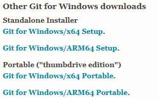
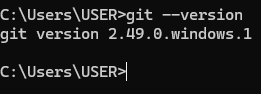
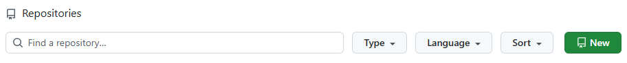
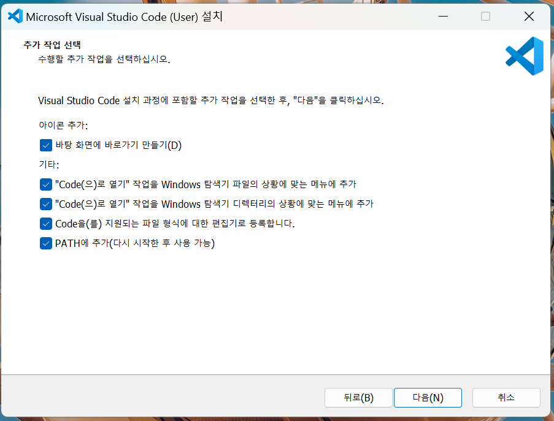
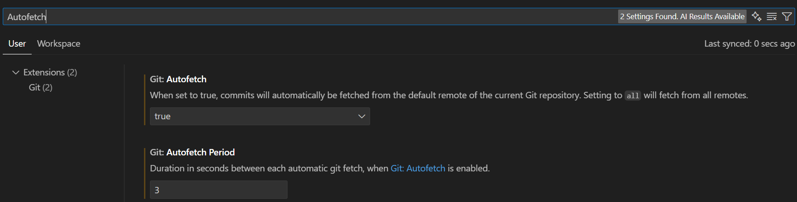
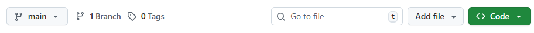
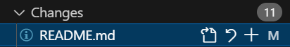
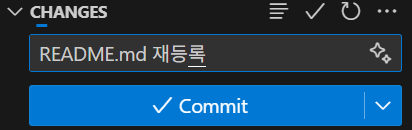
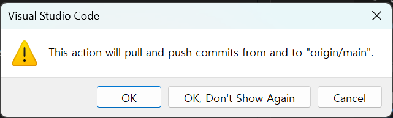

# hello-git

<br>

## 1. Git 설치

<br>

### (1) Git 다운로드

&nbsp;&nbsp;&nbsp;&nbsp;**1)** [https://git-scm.com](https://git-scm.com) 접속

&nbsp;&nbsp;&nbsp;&nbsp;**2)** **Install** 버튼 클릭

&nbsp;&nbsp;&nbsp;&nbsp;

&nbsp;&nbsp;&nbsp;&nbsp;**3)** 운영체제에 맞는 설치 파일 다운로드
   
&nbsp;&nbsp;&nbsp;&nbsp;

<br>

### (2) 설치 확인

&nbsp;&nbsp;&nbsp;&nbsp;**1)** 설치 완료 후 **명령 프롬프트(cmd)** 또는 **터미널** 실행

&nbsp;&nbsp;&nbsp;&nbsp;**2)** 아래 명령어를 입력하여 설치 확인

```bash
git --version
```

&nbsp;&nbsp;&nbsp;&nbsp;**3)** Git 버전이 표시되면 설치 완료! ✅

&nbsp;&nbsp;&nbsp;&nbsp;

<br>

---

<br>

## 2. Repository 생성

<br>

### (1) GitHub 접속 및 Repository 생성

&nbsp;&nbsp;&nbsp;&nbsp;**1)** [https://github.com/ubisam-research](https://github.com/ubisam-research) 접속

&nbsp;&nbsp;&nbsp;&nbsp;**2)** **Repositories** 오른쪽의 **New** 버튼 클릭

&nbsp;&nbsp;&nbsp;&nbsp;

&nbsp;&nbsp;&nbsp;&nbsp;**3)** Repository 생성

&nbsp;&nbsp;&nbsp;&nbsp;- **Repository name**: `com.ubisam.대분류.소분류`  
&nbsp;&nbsp;&nbsp;&nbsp;- **Visibility**: Private  
&nbsp;&nbsp;&nbsp;&nbsp;- **Add README**: 체크 ✅  
&nbsp;&nbsp;&nbsp;&nbsp;- **Add .gitignore**: Java  
&nbsp;&nbsp;&nbsp;&nbsp;- **License**: Apache License 2.0

&nbsp;&nbsp;&nbsp;&nbsp;**4)** **Create repository** 클릭

<br>

---

<br>

## 3. VS Code 설치

<br>

&nbsp;&nbsp;&nbsp;&nbsp;**1)** [https://code.visualstudio.com/](https://code.visualstudio.com/) 접속

&nbsp;&nbsp;&nbsp;&nbsp;**2)** **Download for Windows** 버튼 클릭

&nbsp;&nbsp;&nbsp;&nbsp;**3)** 설치 진행 시 다음 항목들을 체크

&nbsp;&nbsp;&nbsp;&nbsp;

<br>

---

<br>

## 4. VS Code Git 설정

<br>

&nbsp;&nbsp;&nbsp;&nbsp;**1)** **VS Code** 실행

&nbsp;&nbsp;&nbsp;&nbsp;**2)** 좌측 하단의 톱니바퀴 아이콘 클릭

&nbsp;&nbsp;&nbsp;&nbsp;

&nbsp;&nbsp;&nbsp;&nbsp;**3)** **Settings** 메뉴 클릭

&nbsp;&nbsp;&nbsp;&nbsp;**4)** **Autofetch** 검색 

&nbsp;&nbsp;&nbsp;&nbsp;**5)** **Git: Autofetch**를 true로 변경 (Autofetch : Git 원격 저장소(Origin)의 변경 사항을 자동으로 가져오는 기능)

&nbsp;&nbsp;&nbsp;&nbsp;**6)** **Git: Autofetch Period**를 원하는 값으로 변경

&nbsp;&nbsp;&nbsp;&nbsp;

<br>

---

<br>

## 5. Git Repository Clone

<br>

&nbsp;&nbsp;&nbsp;&nbsp;**1)** 복제할 Repository 페이지로 이동

&nbsp;&nbsp;&nbsp;&nbsp;**2)** **<> Code** 버튼 클릭

&nbsp;&nbsp;&nbsp;&nbsp;

&nbsp;&nbsp;&nbsp;&nbsp;**3)** **HTTPS** 탭의 주소 복사

&nbsp;&nbsp;&nbsp;&nbsp;**4)** Windows 탐색기에서 **workspace** 폴더 생성

&nbsp;&nbsp;&nbsp;&nbsp;**5)** 명령 프롬프트를 관리자 권한으로 실행

&nbsp;&nbsp;&nbsp;&nbsp;**6)** workspace 폴더로 이동

```bash
cd workspace
```

&nbsp;&nbsp;&nbsp;&nbsp;**7)** Repository 복제 (본인의 GitHub 사용자명으로 변경)

```bash
git clone https://Parkjinwon1025@github.com/ubisam-research/com.ubisam.persons.jhkim.git
```

&nbsp;&nbsp;&nbsp;&nbsp;**8)** VS Code 실행

```bash
code .
```

<br>

---

<br>

## 6. VS Code에서 Git Commit/Push

<br>

&nbsp;&nbsp;&nbsp;&nbsp;**1)** 파일 내용이나 이름 변경

&nbsp;&nbsp;&nbsp;&nbsp;**2)** VS Code 왼쪽 탭의 **Source Control** 메뉴 선택

&nbsp;&nbsp;&nbsp;&nbsp;

&nbsp;&nbsp;&nbsp;&nbsp;**3)** Changes 섹션에서 업로드할 파일들의 **+ 버튼** 클릭

&nbsp;&nbsp;&nbsp;&nbsp;

&nbsp;&nbsp;&nbsp;&nbsp;**4)** Staged Changes에 파일이 정상적으로 추가되었는지 확인

&nbsp;&nbsp;&nbsp;&nbsp;

&nbsp;&nbsp;&nbsp;&nbsp;**5)** Commit 메시지를 작성하고 **Commit** 버튼 클릭

&nbsp;&nbsp;&nbsp;&nbsp;

&nbsp;&nbsp;&nbsp;&nbsp;**6)** **Sync Changes** 버튼 클릭

&nbsp;&nbsp;&nbsp;&nbsp;

&nbsp;&nbsp;&nbsp;&nbsp;**7)** 팝업창에서 **OK 버튼** 클릭

&nbsp;&nbsp;&nbsp;&nbsp;

<br>

---

<br>

## 7. VS Code에서 Git Pull

<br>

&nbsp;&nbsp;&nbsp;&nbsp;**1)** VS Code 왼쪽 탭의 **Source Control** 메뉴 선택

&nbsp;&nbsp;&nbsp;&nbsp;**2)** **Sync Changes** 버튼 클릭

&nbsp;&nbsp;&nbsp;&nbsp;

&nbsp;&nbsp;&nbsp;&nbsp;**3)** Pull 결과 확인