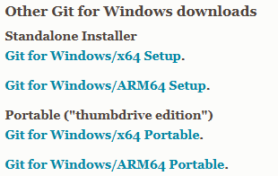
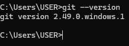
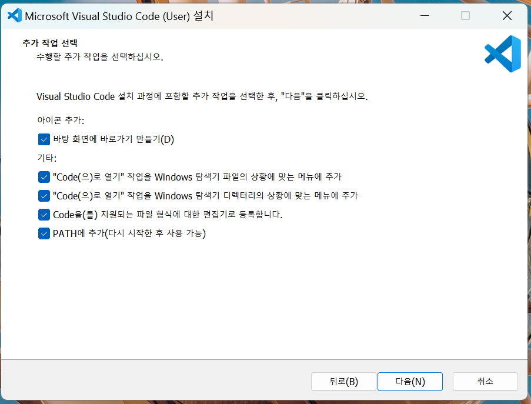
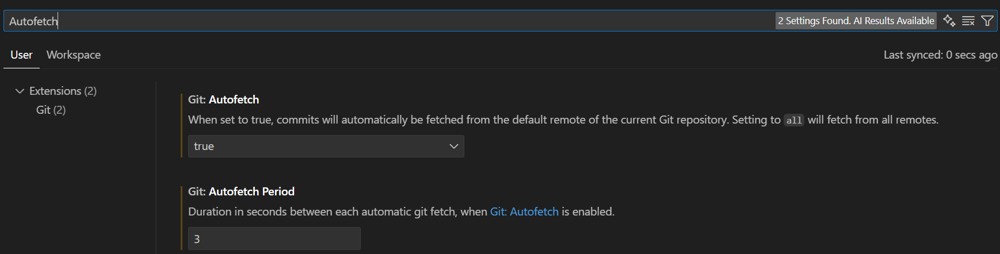
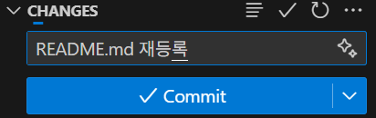
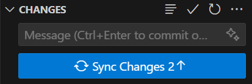
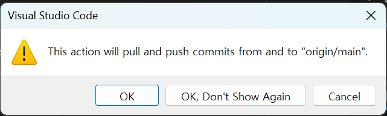

# hello-git

## 📑 목차

1. [Git 및 VS Code 설정](#1-git-및-vs-code-설정)
   - [Git 설치](#1-1-git-설치)
   - [Repository 생성](#1-2-repository-생성)
   - [VS Code 설치](#1-3-vs-code-설치)
   - [VS Code Git 설정](#1-4-vs-code-git-설정)
   - [Git Repository Clone](#1-5-git-repository-clone)
   - [VS Code에서 Git Commit / Push](#1-6-vs-code에서-git-commitpush)
   - [VS Code에서 Git Pull](#1-7-vs-code에서-git-pull)

2. [Docker 패키지 관리](#2-docker-패키지-관리)

<br>

# 1. Git 및 VS Code 설정

## 1-1. Git 설치

### (1) Git 다운로드

1. [https://git-scm.com](https://git-scm.com) 접속

2. **Install** 버튼 클릭

   

3. 운영체제에 맞는 설치 파일 다운로드

   

<br>

### (2) 설치 확인

1. 설치 완료 후 **명령 프롬프트(cmd)** 또는 **터미널** 실행

2. 아래 명령어를 입력하여 설치 확인
```bash
git --version
```

3. Git 버전이 표시되면 설치 완료! ✅

   

<br>

---

<br>

## 1-2. Repository 생성

### (1) GitHub 접속 및 Repository 생성

1. [https://github.com/ubisam-research](https://github.com/ubisam-research) 접속

2. **Repositories** 오른쪽의 **New** 버튼 클릭

   

3. Repository 생성
   - **Repository name**: `com.ubisam.대분류.소분류`
   - **Visibility**: Private
   - **Add README**: 체크 ✅
   - **Add .gitignore**: Java
   - **License**: Apache License 2.0

4. **Create repository** 클릭

<br>

---

<br>

## 1-3. VS Code 설치

1. [https://code.visualstudio.com/](https://code.visualstudio.com/) 접속

2. **Download for Windows** 버튼 클릭

3. 설치 진행 시 다음 항목들을 체크

   

<br>

---

<br>

## 1-4. VS Code Git 설정

1. **VS Code** 실행

2. 좌측 하단의 톱니바퀴 아이콘 클릭

   

3. **Settings** 메뉴 클릭

4. **Autofetch** 검색

5. **Git: Autofetch**를 true로 변경 (Autofetch : Git 원격 저장소(Origin)의 변경 사항을 자동으로 가져오는 기능)

6. **Git: Autofetch Period**를 원하는 값으로 변경

   

<br>

---

<br>

## 1-5. Git Repository Clone

1. 복제할 Repository 페이지로 이동

2. **<> Code** 버튼 클릭

   

3. **HTTPS** 탭의 주소 복사

4. Windows 탐색기에서 **workspace** 폴더 생성

5. 명령 프롬프트를 관리자 권한으로 실행

6. workspace 폴더로 이동
```bash
cd workspace
```

7. Repository 복제 (본인의 GitHub 사용자명으로 변경)
```bash
git clone https://Parkjinwon1025@github.com/ubisam-research/com.ubisam.persons.jhkim.git
```

8. VS Code 실행
```bash
code .
```

<br>

---

<br>

## 1-6. VS Code에서 Git Commit/Push

1. 파일 내용이나 이름 변경

2. VS Code 왼쪽 탭의 **Source Control** 메뉴 선택

   

3. Changes 섹션에서 업로드할 파일들의 **+ 버튼** 클릭

   

4. Staged Changes에 파일이 정상적으로 추가되었는지 확인

   

5. Commit 메시지를 작성하고 **Commit** 버튼 클릭

   

6. **Sync Changes** 버튼 클릭

   

7. 팝업창에서 **OK 버튼** 클릭

   

<br>

---

<br>

## 1-7. VS Code에서 Git Pull

1. VS Code 왼쪽 탭의 **Source Control** 메뉴 선택

2. **Sync Changes** 버튼 클릭

   

3. Pull 결과 확인

<hr style="border: 20px solid black;">
<br>

# 2. Docker 패키지 관리

1. Git Token(classic) 생성 [있으면 안해도 됨.]

2. 폴더 생성
```bash
mkdir docker/mysql
```

3. 디렉터리 이동
``` bash
cd docker/mysql
```

4. `Dockerfile` 생성
``` dockerfile
FROM mysql:9.5.0
```

5. `ghcr.io(GitHub Container Registry)` 로그인
``` bash
docker login ghcr. io
# UserName : GitHub UserName 입력
# Password : 토큰값 입력
```

6. Dockerfile 기반으로 이미지 생성
``` bash
# NameSpace : 자신의 Git 이름 (전부 소문자로 써야함.)
# docker build -t ghcr.io/<NameSpace>/<이미지 이름>:<이미지 태그>
# 맨 뒤에 . 꼭 써야함.
docker build -t ghcr.io/parkjinwon1025/hello:mysql-9.5.0 .
```
7. 이미지 업로드
```bash
# NameSpace : 자신의 Git 이름 (전부 소문자로 써야함.)
# docker push ghcr.io/<NameSpace>/<이미지 이름>:<이미지 태그>
docker push ghcr.io/parkjinwon1025/hello:mysql-9.5.0
```

8. 이미지 실행
```bash
# NameSpace : 자신의 Git 이름 (전부 소문자로 써야함.)
# docker run ghcr.io/<NameSpace>/<이미지 이름>:<이미지 태그>
docker run -d ghcr.io/parkjinwon1025/hello:mysql-9.5.0
```

9. 이미지 가져오기
```bash
# NameSpace : 자신의 Git 이름 (전부 소문자로 써야함.)
# docker pull ghcr.io/<NameSpace>/<이미지 이름>:<이미지 태그>
docker pull ghcr.io/parkjinwon1025/hello:mysql-9.5.0
```

10. `ghcr.io(GitHub Container Registry)` 로그아웃
```bash
docker logout ghcr.io
```
